# Transcriber 📝 🤖

[](https://github.com/danielfcollier/py-transcriber/actions)
[](https://python.org)
[](./LICENSE)

**A local, privacy-focused video transcription tool.**

> **🕵️‍♀️ Privacy Note:** This tool runs **entirely on your computer**. No video or audio data is ever sent to the cloud. It is designed for journalists, researchers, and anyone working with sensitive interviews.

## 🌟 How It Works

For non-technical users, here is the simple workflow:

```mermaid
graph LR
    A[🎥 Video/Audio File] -->|Drag & Drop| B[🖥️ Transcriber App]
    B -->|Processing| C{"🧠 AI Model\n(Local)"}
    C -->|Output| D["📄 Subtitle File\n(.srt)"]
```



## 🚀 Installation & Usage

### Option 1: For End Users (Windows) 🏁

*Best for: Friends, Journalists, and non-coders.*

1. Go to the [download page](https://drive.google.com/file/d/1RVsaYc-SM303L5VLQdRsTm2I9G67an6o/view?usp=drive_link).
2. Download the latest `AutoTranscriber.exe`.
3. Double-click to launch.

### Option 2: For Developers (Source Code) 👩‍💻

*Best for: Modifying the code or building for Linux/Mac.*

This project uses `uv` for fast dependency management and a smart `Makefile` for cross-platform builds.

```bash
# 1. Clone the repository
git clone https://github.com/danielfcollier/py-transcriber.git
cd py-transcriber

# 2. Install dependencies (creates .venv automatically)
make install

# 3. Run the GUI immediately
make run-gui
```

## 🛠️ Building the Standalone App

You can package this tool into a single file (like an `.exe` or Linux binary) to share with friends. The `Makefile` automatically detects your OS (Windows, Linux, or Mac) and downloads the correct FFmpeg version to bundle inside.

**1. Download FFmpeg (Automated):**

```bash
make download-ffmpeg
```

**2. Build the App:**

```bash
make build
```

**3. Locate your App:**

* **Windows:** `dist/AutoTranscriber.exe`
* **Linux/Mac:** `dist/AutoTranscriber`

> **Mac Users:** If you see an "Unverified Developer" warning, right-click the file and select **Open** while holding the `Control` key.

## 💻 CLI Usage

For power users who want to script their workflow:

```bash
# Basic usage (defaults to 'base' model and 'srt' format)
uv run transcriber-cli "interview_recording.mp4"

# High accuracy mode (slower)
uv run transcriber-cli "interview_recording.mp4" --model large

# Export as plain text instead of subtitles
uv run transcriber-cli "meeting.wav" --format txt
```

## 🧠 Model Guide

Balance speed versus accuracy by choosing the right model size.

| Model | Speed | Accuracy | Memory (VRAM) | Recommended For |
| --- | --- | --- | --- | --- |
| **tiny** | ⚡ Very Fast | Low | ~1 GB | Quick checks, clear English audio. |
| **base** | 🐇 Fast | Decent | ~1 GB | **Default.** Good balance for most uses. |
| **small** | 🐢 Moderate | Good | ~2 GB | Non-English audio or accents. |
| **medium** | 🐌 Slow | Very Good | ~5 GB | High quality publishing. |
| **large** | 🦥 Very Slow | Best | ~10 GB | Professional transcription / difficult audio. |

## 👤 Author

**Daniel Collier**

* Staff Platform Engineer & Open Source Enthusiast
* [LinkedIn Profile](https://www.linkedin.com/in/danielfcollier/)

## 🤝 Contributing

We use `make` to automate development tasks.

* `make install`: Install dependencies.
* `make lint`: Check code style with Ruff.
* `make format`: Auto-format code.
* `make build`: Generate the standalone app for your OS.

## 📄 License

This project is licensed under the MIT License - see the [LICENSE](.LICENSE.md) file for details.
